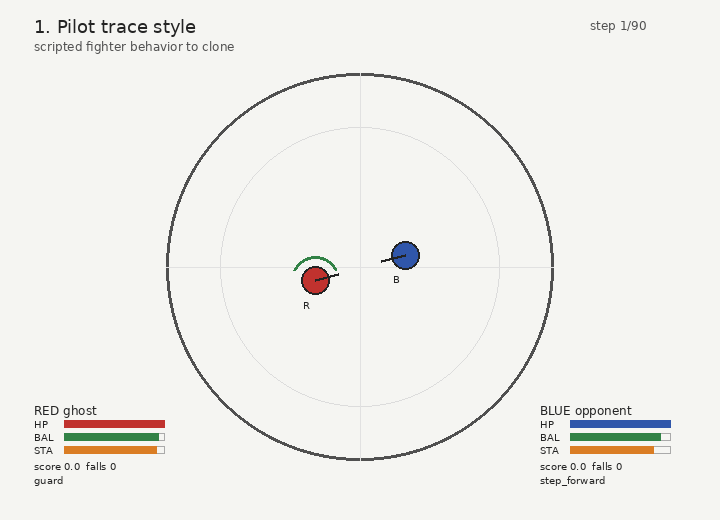
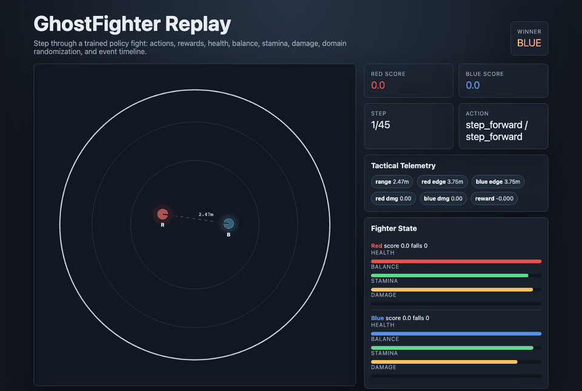

# GhostFighter

GhostFighter is a compact robot-combat autonomy lab. It provides a fast fight simulator, attribute-driven policy generation, PPO self-play, safety shielding, domain randomization, league analysis, robustness tests, dashboards, GIFs, and an offline HTML replay viewer.



The project is not trying to solve low-level humanoid motor control. It focuses on the decision layer above motor control: how a robot policy chooses tactics, responds under pressure, handles degraded state, gets evaluated, and produces evidence that a reviewer can inspect.

The fighting-game inspiration is intentional. A robot policy can look like a fighting style from the outside: pressure-heavy, evasive, defensive, counter-oriented, or recovery-focused. In GhostFighter those are not hard-coded identities. They are policy attributes, rollout generators, opponent roles, and training/evaluation conditions that make behavior measurable.

## What The System Does

1. Generates Generation Zero rollout data from user-specified policy attributes.
2. Trains conditional policies and PPO self-play agents from simulated fights.
3. Runs raw-vs-shielded evaluation with a combat safety firewall.
4. Stress-tests policies under actuator damage, low balance, boundary pressure, perturbations, and randomized domain conditions.
5. Produces reviewer artifacts: model cards, run cards, dashboards, benchmark reports, replay JSON, GIF demos, and an interactive HTML fight viewer.

## Install

```bash
python -m venv .venv
source .venv/bin/activate
pip install -r requirements.txt
make test
```

No MuJoCo, Isaac, ROS, or GPU is required for the local backend.

## Run The Lab

Fast smoke test:

```bash
make smoke
```

Run the browser game locally:

```bash
cd web
npm install
npm run dev
```

Full review run:

```bash
python -m ghostfighter.cli all --out runs/default \
  --episodes-per-style 80 --epochs 8 --eval-episodes 160 \
  --stress --benchmark --scale-study --self-play --rl \
  --robustness --replay-viewer --domain-randomization
```

PPO self-play with vectorized local rollouts:

```bash
python -m ghostfighter.cli train-rl \
  --out runs/default/rl \
  --envs 8 \
  --updates 8 \
  --matches-per-update 64 \
  --max-steps 90
```

Inspect a trained PPO policy:

```bash
python -m ghostfighter.cli robustness \
  --policy runs/default/rl/ppo_policy.pt \
  --out runs/default/robustness

python -m ghostfighter.cli replay-viewer \
  --policy runs/default/rl/ppo_policy.pt \
  --out runs/default/replay
```

## Core Concepts

**Policy attributes:** Generation Zero starts from configurable behavior parameters such as engagement drive, guard discipline, counter timing, lateral mobility, stamina discipline, boundary awareness, damage targeting, risk tolerance, and close-range pressure. These attributes create diverse rollout data without relying on one fixed scripted teacher.

**Self-play league:** PPO agents train against role-based and historical opponents. Training logs include reward terms, KL, clip fraction, entropy, explained variance, Elo-style ratings, payoff matrices, meta-strategies, best responses, and exploitability estimates.

**Safety firewall:** The firewall evaluates proposed actions before execution and can replace risky moves. It uses balance, stamina, boundary pressure, actuator damage, cooldown state, momentum, incoming contact, and likely whiffs. Evaluation compares raw policy behavior against shielded behavior.

**Deployment incumbent:** Training does not automatically ship the latest PPO checkpoint. GhostFighter keeps a retained incumbent checkpoint selected by a conservative deployment score that accounts for Elo, win rate, and fall rate.

**Replay evidence:** The HTML viewer is a standalone fight analysis console. It shows the arena, actions, reward trace, event markers, health, balance, stamina, damage, range, edge clearance, domain profile, keyboard playback, and PNG snapshot export.

**Browser game:** The Vite web app turns GhostFighter into an autonomy-first playable arena. The default view is autonomous policy-vs-policy combat; manual PvP is framed as teleoperation/override testing. It also supports WebRTC invite/answer online PvP, human-vs-bot, in-browser policy training, bot DNA import/export, and shareable challenge URLs so players can fight trained ghosts from other users.

## Artifacts To Inspect

```text
runs/default/
  data/traces.npz
  data/traces.summary.json
  gen0/GENERATION_ZERO_CARD.md
  selfplay/SELF_PLAY_CARD.md
  rl/ppo_policy.pt
  rl/ppo_incumbent.pt
  rl/ppo_training_curve.csv
  rl/ppo_reward_terms.csv
  rl/payoff_matrix.csv
  rl/meta_strategy.csv
  rl/LEAGUE_ANALYSIS.md
  rl/INCUMBENT.md
  robustness/ROBUSTNESS_REPORT.md
  replay/replay.json
  replay/replay_viewer.html
  reports/dashboard.png
  reports/safety_dashboard.png
  reports/safety_case.md
  videos/ghostfighter_demo.gif
  MODEL_CARD.md
  RUN_CARD.md
```

## Simulator Surface

The local simulator exposes high-level humanoid combat actions:

```text
guard, step_forward, step_back, sidestep_left, sidestep_right,
circle_left, circle_right, jab, cross, hook, low_kick, push, recover
```

It tracks ring position, heading, stamina, guard, balance, health, knockdowns, actuator damage, cooldowns, contact events, scoring, and match termination. This keeps the project small enough to run quickly while still exercising autonomy problems that matter: tactical choice, safety intervention, recovery, robustness, and evaluation discipline.

## Scale Path

The local backend is for iteration, CI, and review. The interfaces are shaped so the same policy roles, domain-randomization profiles, PPO loop, and failure/replay artifacts can move to Isaac Lab for massive vectorized rollout generation and MuJoCo for higher-fidelity validation.

## Replay Viewer Preview


